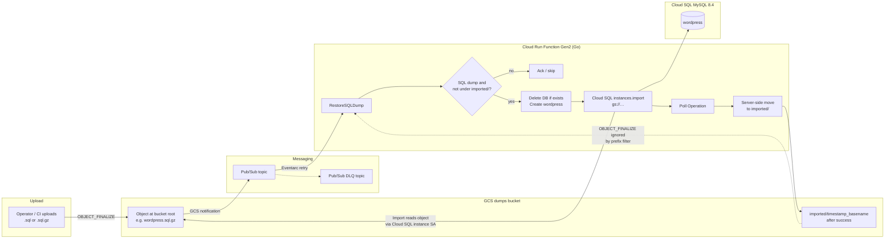
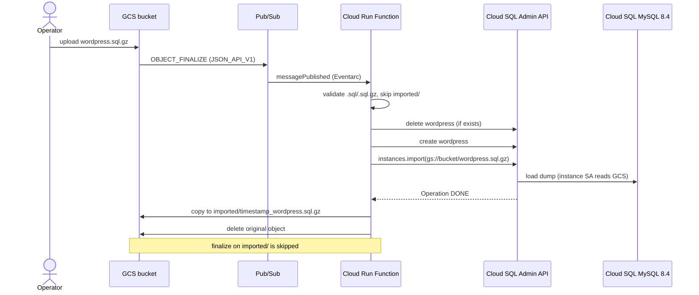

# Architecture

PoC flow: upload a WordPress MySQL dump to GCS, restore it into Cloud SQL via
the Admin Import API, then archive the object under `imported/`.

## Diagram

## Sequence

## Identities

| Principal | Role |
|-----------|------|
| Function SA | Custom Cloud SQL orchestrator role + `roles/storage.objectUser` on dumps bucket |
| Cloud SQL instance SA | `roles/storage.objectViewer` on dumps bucket (Import read) |
| GCS project SA | `roles/pubsub.publisher` on the dumps topic |

See also: [ADR-001](decisions/ADR-001-cloudsql-import-api.md), [ADR-002](decisions/ADR-002-pubsub-trigger.md), [ADR-003](decisions/ADR-003-go-least-privilege.md).
